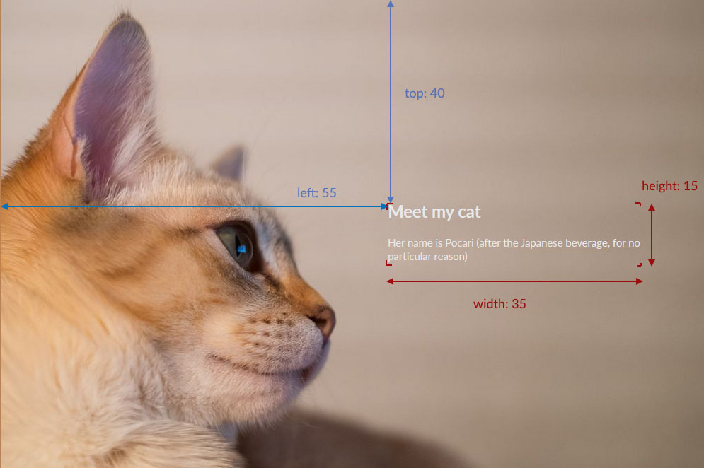

pyxpose
=======
A static site generator for photoessays, inspired by [Exposé](https://github.com/Jack000/Expose).

What it does
-------------
Pyxpose turns a collection of photo inside a folder into a photoessays with embedded, markdown-formatted captions (if existing).

Look at the demo to see what it looks like.

Installation
------------
Run pyxpose.exe as a command line application.

Alternatively, you can also run pyxpose.py as a regular python CLI script.

Usage
-----

```
Usage:
    pyxpose.py <gallery-path>
    pyxpose.py <gallery-path> --template=<template-path>

Option:
    --template=<template-path>    Define another template [default: ./template/]
```

The script scans a folder in <gallery-path> for existing .jpg, extracts their EXIF and other metadata, resize the photos into various common sizes and create a gallery.html file.

Image are sorted in alphabetical order. *Hint*: to arbitrarily order the image, add a numerical prefix.

Gallery title and sidebar
-------------------------
If a gallery-description.txt or gallery-description.md file is present in the gallery folder
You can customize the page title along with the sidebar by adding a gallery-description.txt or gallery-description.md file to your folder. This file is formatted as such:

```
title: <Title of your gallery> (optional, default to: "Photo gallery")
short-description: <Short description appearing in search engines> (optional, default to an empty field ("") )

<Sidebar content formatted in [Markdown](https://en.wikipedia.org/wiki/Markdown)>
```

Example:

```
title: My trip to Camelot
short-description: A photoessay about my trip to Camelot

Welcome to this gallery ! We went to a lot of exciting places, including
  * A French castle
  * A shrubbery
  * Castle Anthrax
```

Captions
--------
You can display a caption  by filling the photo's "caption" or "subject" field  in your favorite photo processor software.

The caption should be formatted as such:

```
top: <position of the text block relative to the top of the photo (percent)>
left: <position of the text block relative to the left of the photo (percent)>
width: <width of the text block(percent)>
height: <width of the text block(percent)>

<Caption content formatted in [Markdown](https://en.wikipedia.org/wiki/Markdown)>
```

Example:

```
top: 40
left: 60
width: 30
height: 20

'tis a silly place. And it's only a *model*.
```



*Note*: Since eye-balling percentage positionning and size is rather difficult, grids overlay for the most common aspect ratios are provided in the overlay folder. In Adobe Photoshop Lightroom, you can display it by going to View > Loupe overlay > Choose layout image (alternatively, ctrl-shift-alt-o). Aditionnaly, some software (in particular Lightroom) will input a new line only if you press ctrl-enter.

Textual slides
--------------
Text (.txt) or Markdown (.md) files will be processed and displayed as slides with no photo in the background. Those files are expected to be formatted in Markdown, meaning that regular HTML also works.

This is handy to display some embedded maps. You might want to pay attention to the `width`, `height` and `style` attribute of the iframe. In the `style` attribute, I usually set `float: left;` and  `margin-left: 1em` so that the map stays on the left and doesn't stick to the text at the right. HTML and CSS is out of the scope of this readme; if you want to learn more, I suggest [this tutorial by Shay How](http://learn.shayhowe.com/).

Unprocessed files
-----------------
Files prefixed by "_" won't be processed.

Files suffixed with "_private" won't be processed *unless* the --allowprivate option is invoked.

Theme
------
Don't like how the default theme look like ? Write your own ! It is using the [jinja2 templating engine](http://jinja.pocoo.org/). See its [documentation to design your own template](http://jinja.pocoo.org/docs/dev/templates/).

Within the template, you have access to the following variable:
* `gallery_title` : (str) Gallery title
* `gallery_description` : (str) Gallery short description
* `slides`:
  * `slide['type']` : (str, 'photo' or 'text') A string describing if the slide is a photo or just text.
  * slide['data']` : (str or dict) If the slide is just text, contains the actual text. Otherwise it's a dict containing:
    * `slide['data']['filename']` : (str) Filename of the photo
    * `slide['data']['color']`: (list) rgb value of the second most most common color. Access with slide['data']['color'][0], slide['data']['color'][1] and slide['data']['color'][2].
    * `slide['data']['complement_color']`: (list) rgb value of the second most most common color, with a different luminance Useful for text. Access is the same as `color`.
    * `slide['data']['caption']`: (str) Text data of the caption
    * `slide['data']['caption_meta']`: (dict) holds information about where the caption textbox should be
      * `slide['data']['caption_meta']['top']` (int) position from top, in percent
      * `slide['data']['caption_meta']['left']` (int) position from left, in percent
      * `slide['data']['caption_meta']['width']` (int) width, in percent
      * `slide['data']['caption_meta']['height']` (int) height, in percent
    * `slide['data']['exposure_data']`: (dict) holds information about how the photo was taken
      * `slide['data']['exposure_data']['aperture']`: (str) Aperture in decimal form (e.g. "2.8")
      * `slide['data']['exposure_data']['exposure_time']`: (str) Shutter speed in fractional form (e.g. "1/60")
      * `slide['data']['exposure_data']['iso']`: (str) ISO
      * `slide['data']['exposure_data']['focal_length']`: (str) Focal length
      * `slide['data']['exposure_data']['lens_maker']`: (str)  Lens maker (e.g. "FUJIFILM")
      * `slide['data']['exposure_data']['lens_model']`: (str) Lens model (e.g. "XF35mmF1.4 R")
      * `slide['data']['exposure_data']['camera_maker']`: (str) Camera maker (e.g. "NIKON CORPORATION")
      * `slide['data']['exposure_data']['camera_model']`: (str) Camera model (e.g. ('NIKON D810'))
